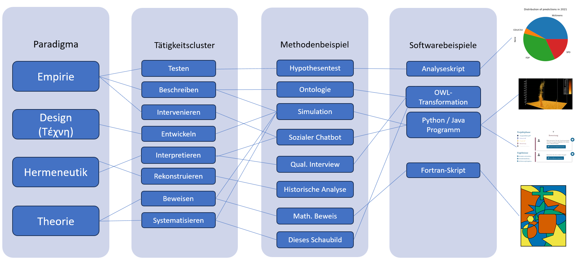

# Modulübersicht

## Modulschwerpunkt

Das Modul behandelt das komplexe Zusammenspiel von Software als Bestandteil des reproduzierbaren Forschungsprozesses sowie als eigenständige Variable und Forschungsergebnis.

- Ähnlich wie in der Statistik erweitert der Einsatz von Computertechnologie die möglichen Forschungsthemen
- Gleichzeitig entstehen neue Fehlerquellen, erhöhte Komplexität und entsprechende methodische Ansätze

## Behandelte Themen

Dies umfasst unter anderem:

- Formen von Forschung und disziplinäre Kulturen
- Empirische Forschungsmethoden (z. B. zur Softwareevaluation)
- Designbasierte Forschung und Design Science
- Qualitative und quantitative Methoden
- Computerbasierte Methoden und Mixed-Methods-Ansätze

# Grundfragen empirischer Sozialforschung

Problemfragen, die immer zuerst geklärt werden müssen [@zapf]:

1. Kann das Handeln der Akteure besser quantitativ erklärt, oder
qualitativ gedeutet werden?
(Handeln erklären oder deuten?)
2. Sind Massenumfragen, oder Einzelfallstudien besser geeignet?
(Eine soziale Welt oder typische Unterschiede)
3. Wie distanziert muss ein Forscher sein, soll er sich auf Grundlage seiner Erkenntnisse engagieren?
(Wo endet die Verantwortung des Wissenschaftlers?)
4. Soll Grundlagenforschung, oder praxisorientierte Forschung
(Anwendungsforschung) betrieben werden?

# Verhältnis von Theorie und Empirie [@zapf]

## Theorie

- Ein System von Wissen über die Wirklichkeit
- Eine systematisch geordnete Menge von Aussagen über einen Teilbereich der Wirklichkeit

- Theoriebildung ist ein Prozess:
    - Aufstieg von relativen Wahrheiten niedrigerer zu höheren Stufen
    - Es gibt keine endgültigen Wahrheiten oder Theorien

- Erkenntnis ist ein fortlaufender Prozess:
    - Man „steigt Sprossen hinauf“, aber erreicht kein Ende

---

## Eigenschaften von Theorien

- Funktion:
    - Explanativ (erklärend)
    - Prognostisch (vorhersagend)

- Kriterien:
    - Widerspruchsfreiheit
    - Vollständigkeit
    - Unabhängigkeit

- Theorien befassen sich mit beobachtbaren Vorgängen
- Sie verbieten bestimmte Beobachtungen:
    - Werden diese dennoch beobachtet → Theorie ist widerlegt

---

## Empirischer Gehalt von Theorien

- Je größer der empirische Gehalt:
    - desto mehr potenzielle Widerlegungen sind möglich
    - desto „riskanter“ ist die Theorie

- Je präziser eine Theorie:
    - desto geringer ihre Reichweite
    - desto näher an der Wirklichkeit

- Wichtig:
    - Man weiß nicht, was empirisch „wahr“ ist
    - Man weiß nur, was bisher nicht widerlegt wurde

- Empirische Theorien sind immer vorläufig
- Sie erfordern kontinuierliche kritische Diskussion

---

## Empirie

- Gesamtheit von Verfahren zur Datengewinnung:
    - basierend auf (vermeintlich) unmittelbarer Sinneswahrnehmung

- Ablauf empirischer Forschung:
    - Ausgangspunkt: Problem
    - Aufstellung von Hypothesen
    - Empirische Überprüfung

- Empirische Daten:
    - führen zur Modifikation von Theorien

---

## Verhältnis von Theorie und Empirie

- Theorie und Empirie durchdringen sich gegenseitig

- Erkenntnisprozess:
    - vom Empirischen zum Theoretischen
    - (Empfindung → Wahrnehmung → Begriff)

- Wichtig:
    - Theorie lässt sich nicht auf Empirie reduzieren
    - Jede Forschungsmethode enthält Theorie und Empirie
    - Forschungsmethoden unterscheiden sich primär durch die Annahmen, _was empirisch wie erfassbar ist_ und wie es sich theoretisch _deuten lässt_

# Was ist Forschungssoftware?

## Forschungssoftware

::: {.columns}

::: {.column width="40%"}

:::

::: {.column width="60%"}

„Forschungssoftware umfasst Quellcodedateien, Algorithmen, Skripte, rechnergestützte Workflows und ausführbare Programme, die im Forschungsprozess oder für einen Forschungszweck erstellt wurden.“ [@gruenpeterDefiningResearchSoftware2021]

:::

:::

# Forschungsparadigmen

# Verhältnis empirische Methoden und Forschungssoftware

# Beispiel 1: RouteMe

# Forschungsfragen zu RouteMe?

# Methoden empirischer Sozialforschung

## Qualitativ

## Quantitativ

## Mixed Methods

## Messungen

## Datengetriebene Forschung

## TextAsData und mehr

# Welche Methoden passen für RouteMe?

# Reflexionsfragen

# Literatur

