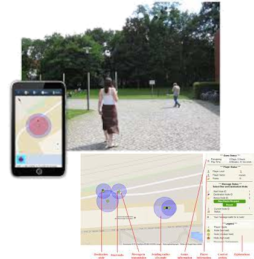
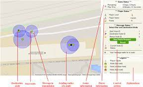

# Modulübersicht

## Modulschwerpunkt

Das Modul behandelt das komplexe Zusammenspiel von Software als Bestandteil des reproduzierbaren Forschungsprozesses sowie als eigenständige Variable und Forschungsergebnis.

- Ähnlich wie in der Statistik erweitert der Einsatz von Computertechnologie die möglichen Forschungsthemen
- Gleichzeitig entstehen neue Fehlerquellen, erhöhte Komplexität und entsprechende methodische Ansätze

---

## Behandelte Themen

Dies umfasst unter anderem:

- Formen von Forschung und disziplinäre Kulturen
- Empirische Forschungsmethoden (z. B. zur Softwareevaluation)
- Designbasierte Forschung und Design Science
- Qualitative und quantitative Methoden
- Computerbasierte Methoden und Mixed-Methods-Ansätze


# Warum Sozialforschung in der Informatik?

- Anwendungskontext von Software sind häufig soziale Prozesse
  - Erforschung sozialer Netzwerke
  - Nutzbarkeitsstudien
  - Technikakzeptanzstudien
  - Gewünschter Effekt ist häufig Handlungsänderungen
- Lernverhalten ist sozial determiniert (relevant für Bildungstechnologien)
- Anforderungserhebung ist sozial beeinflusst (Organisationssoziologie)
- Softwareentwicklungsprozesse erfordert hohe soziokognitive Fähigkeiten (Juckeland bei Workshop RSE Dresden, 2025)

# Grundfragen empirischer Sozialforschung

Problemfragen, die immer zuerst geklärt werden müssen [@zapf]:

1. Kann das Handeln der Akteure besser quantitativ erklärt, oder
qualitativ gedeutet werden?
(Handeln erklären oder deuten?)
2. Sind Massenumfragen, oder Einzelfallstudien besser geeignet?
(Eine soziale Welt oder typische Unterschiede)
3. Wie distanziert muss ein Forscher sein, soll er sich auf Grundlage seiner Erkenntnisse engagieren?
(Wo endet die Verantwortung des Wissenschaftlers?)
4. Soll Grundlagenforschung, oder praxisorientierte Forschung
(Anwendungsforschung) betrieben werden?


# Verhältnis von Theorie und Empirie [@zapf]

## Theorie

- Ein System von Wissen über die Wirklichkeit
- Eine systematisch geordnete Menge von Aussagen über einen Teilbereich der Wirklichkeit

- Theoriebildung ist ein Prozess:
    - Aufstieg von relativen Wahrheiten niedrigerer zu höheren Stufen
    - Es gibt keine endgültigen Wahrheiten oder Theorien

- Erkenntnis ist ein fortlaufender Prozess:
    - Man „steigt Sprossen hinauf“, aber erreicht kein Ende

---

## Eigenschaften von Theorien

- Funktion:
    - Explanativ (erklärend)
    - Prognostisch (vorhersagend)

- Kriterien:
    - Widerspruchsfreiheit
    - Vollständigkeit
    - Unabhängigkeit

- Theorien befassen sich mit beobachtbaren Vorgängen
- Sie verbieten bestimmte Beobachtungen:
    - Werden diese dennoch beobachtet → Theorie ist widerlegt

---

## Empirischer Gehalt von Theorien

- Je größer der empirische Gehalt:
    - desto mehr potenzielle Widerlegungen sind möglich
    - desto „riskanter“ ist die Theorie

- Je präziser eine Theorie:
    - desto geringer ihre Reichweite
    - desto näher an der Wirklichkeit

- Wichtig:
    - Man weiß nicht, was empirisch „wahr“ ist
    - Man weiß nur, was bisher nicht widerlegt wurde

- Empirische Theorien sind immer vorläufig
- Sie erfordern kontinuierliche kritische Diskussion

---

## Empirie

- Gesamtheit von Verfahren zur Datengewinnung:
    - basierend auf (vermeintlich) unmittelbarer Sinneswahrnehmung

- Ablauf empirischer Forschung:
    - Ausgangspunkt: Problem
    - Aufstellung von Hypothesen
    - Empirische Überprüfung

- Empirische Daten:
    - führen zur Modifikation von Theorien

---

## Verhältnis von Theorie und Empirie

- Theorie und Empirie durchdringen sich gegenseitig

- Erkenntnisprozess:
    - vom Empirischen zum Theoretischen
    - (Empfindung → Wahrnehmung → Begriff)

- Wichtig:
    - Theorie lässt sich nicht auf Empirie reduzieren
    - Jede Forschungsmethode enthält Theorie und Empirie
    - Forschungsmethoden unterscheiden sich primär durch die Annahmen, _was empirisch wie erfassbar ist_ und wie es sich theoretisch _deuten lässt_

---

## Erkenntnisrichtungen des Erkenntnisgewinns

- Induktiv: Von Daten werden theoretische Erkenntnisse abgeleitet
- Deduktiv: Theorie wird durch neue Daten überprüft und erweitert
- Abduktiv: Bei der Abduktion schließt man auf allgemeine Prinzipien oder Hintergründe, die beobachtete Daten erklären könnten [@stangl2026abduktion]
  - kreativer Prozess
  - Interpretation als Puzzlestück, dass Theorie und Empirie verbindet (Referenzrahmen entdecken)

# Was ist Forschungssoftware?

## Forschungssoftware


::: {.columns}

::: {.column width="40%"}


:::

::: {.column width="40%"}

„Forschungssoftware umfasst Quellcodedateien, Algorithmen, Skripte, rechnergestützte Workflows und ausführbare Programme, die im Forschungsprozess oder für einen Forschungszweck erstellt wurden.“ [@gruenpeterDefiningResearchSoftware2021]

:::

:::

# Forschungsparadigmen


# Verhältnis empirische Methoden und Forschungssoftware

Forschungssoftwareentwicklung und empirische Methoden können in unterschiedlichem Verhältnis zueinander stehen [@dehne2026fairrightmethodologicalresearch]:

1. Forschungssoftware ist Gegenstand der empirischen Untersuchung
   - Usability Study
   - Human-Computer Interaction als Fokus
2. Forschungssoftware ist eine Variable der Forschungsfrage
3. Forschungssoftware transformiert den Forschungskontext
4. Forschungssoftware ist nur technisches Hilfsmittel
5. Forschungssoftwareentwicklung ist Lerngegenstand
6. Forschungssoftware implementiert die (automatisierbare/quantifizierbare) Methode (z.B. Tracking, Survey-Bots ...)

# Beispiel 1: RouteMe


::: {.columns}

::: {.column width="30%"}



:::

::: {.column width="30%"}



:::

::: {.column width="30%"}

Ein Lernspiel, um adhoc-Netzwerke aus Sicht eines Knotens kennenzulernen [@Zender2013]

:::

:::

# Forschungsfragen zu RouteMe (interaktiv)?

- Welche empirischen Forschungsfragen könnte man stellen?
- Welche theoretischen Forschungsfragen könnte man stellen?
- Welche methodischen Probleme gibt es in jedem Fall?
- In welchem Verhältnis steht die Forschungssoftware (die App) zu der empirischen Forschung?

# Methoden empirischer Sozialforschung

## Qualitativ [@zapf]

- Deuten, Interpretieren der Verarbeitungsstrategien/ Innenperspektive (wie tickt der Mensch?)
- Zirkulärer Forschungsprozess
- Handlungsdeterminanten, sind den handelnden Personen selbst nicht als handlungsbeeinflussend bewusst
- Qualitative Forschung hat Ausgangspunkt
im Versuch eines vorrangig deutenden und sinnverstehenden
Zugangs zu der interaktiv hergestellten und in sprachlichen wie nicht sprachlichen Symbolen repräsentiert
gedachten sozialen Wirklichkeit
- Will Einzelhandeln dicht beschreiben
- Aufdecken von _Mechanismen_ sozialen Handelns (Dehne)

---

## Mechanismen

- Typische, sich wiederholende Handlungsimpulse (eigene Definition)
- Grundlage agentenbasierter Modellierung
- "Physikalische Gesetze sozialer Handlungen"
- Definitionsbereich sind Gruppenhandlungen, die sich auf Basis einer Einzelhandlung erklären lassen

&rarr; Beispiel Segregation in Städten, auf Distanz sitzen im Zug, Teilen von Mitschriften für Klausuren
&rarr; Mechanismen sind eine Grundannahme für Simulationen (= computerbasierte Verfahren der Sozialforschung)

---

## Quantitativ [@zapf]

- Grundpfeiler: Zahlen/Arbeit mit
Zahlen
- Zahl als Hauptmedium, um soziale
Wirklichkeit zu ordnen und zu
beschreiben
- Quantifizierung= qualitative
Merkmale in Zahlen und damit in
messbare Größen umwandeln
- Prinzip der Deduktion & Prüfung von
Hypothesen
- Voraussetzung = Standardisierung
des Forschungsprozesses

---

## Zuordnung Forschungsfragen

| Frage                                                                   | Quantitativ | Qualitativ |
|-------------------------------------------------------------------------|-------------|------------|
| Wie stark hängen geringer Bildungsstand und Rechtsextremismus zusammen? |             |            |
| Mit welcher Motivation beginnen Studierende ihr Studium?                |             |            |
| Was veranlasst Menschen, die CDU zu wählen?                             |             |            |
| Wie groß ist der Anteil der Studierenden mit BAföG?                     |             |            |

---

## Zuordnung Forschungsfragen

| Frage                                                                   | Quantitativ | Qualitativ |
|-------------------------------------------------------------------------|-------------|------------|
| Wie stark hängen geringer Bildungsstand und Rechtsextremismus zusammen? | korrekt     |            |
| Mit welcher Motivation beginnen Studierende ihr Studium?                |             | korrekt    |
| Was veranlasst Menschen, die CDU zu wählen?                             |             | korrekt    |
| Wie groß ist der Anteil der Studierenden mit BAföG?                     | korrekt     |            |


# Computerbasierte Verfahrung und direkte Messung

- Messungen
  - Hautleitfähigkeit (Indikator für Nervosität)
  - EKG
  - Eye Tracking (Fokussierung / Pupillenweitung)
  - ...
- Datengetriebene Forschung
  - Logdaten
  - Tracking
  - Geoposition
  - ...
- TextAsData (VideoAsData)

# Entscheidungsbaum Methoden

```{=latex}
\input{decision_tree_methods}

```

# Welche Methoden passen für RouteMe?

## Leitfragen

- Ist der Erkenntnisgewinn empirischer Natur oder geht es um Theorieentwicklung?
- Was ist Gegenstand der Forschungsfrage?
- Gibt es soziale Erwünschtheit?
- Sind die Informationen den Teilnehmenden bewusst zugänglich?
- Was lässt sich messen?
- Welche Methoden sind geeignet?

---

## Leitfragen (Antworten)

- Ist der Erkenntnisgewinn empirischer Natur oder geht es um Theorieentwicklung?  &rarr;  Eigentlich geht es um die Entwicklung einer Theorie zu pervasive Learning bzw. game-based learning, aber in der Praxis geht es erstmal um Evaluation der App (empirisch)
- Was ist Gegenstand der Forschungsfrage? &rarr; Motivation, Funktionalität der App
- Gibt es soziale Erwünschtheit? &rarr; teilweise
- Sind die Informationen den Teilnehmenden bewusst zugänglich? &rarr; teilweise
- Was lässt sich messen? &rarr; Wissensfortschritt zu Ad-Hoc Netzwerken
- Welche Methoden sind geeignet? &rarr; nicht teilnehmende Beobachtung, Semantisches Differenzial

# Simulationen als Sonderfall [@drogoulMultiagentBasedSimulation2003]

```{=latex}
\input{latex/simulation_uml.tex}
```


# The Research Process [@schnell1999methoden]


```{=latex}
\input{latex/research_process.tex}
```

# Hausaufgabe (Reflexionsaufgaben)

- Formulieren Sie eine Hypothese, die mit einem Telefoninterview / einer Feld-Beobachtung / einem qualitativen Labor-Experiment überprüfbar ist!
- Mit welchem Datenerhebungsverfahren würden Sie messen: Das Umweltbewusstsein von Wissenschaftlern / das aktuelle Image einer Professorin / die Beliebtheit von Programmiersprachen?
- Sie sollen überprüfen, warum die Effizienz einer Forschungsgruppe trotz guter Qualifikation und Motivation ihrer Mitglieder immer mehr nachlässt. Welches Datenerhebungsverfahren benutzen Sie?
- Sie sollen überprüfen, welchen Einfluss die unterschiedlichen Möglichkeiten der Finanzierung eines Projektes auf die Projektdauer und den Projekterfolg haben. Welches Datenerhebungsverfahren benutzen Sie?
- Sie wollen ein didaktisches Design für die Vermittlung von RSE und Data Science Kompetenzen in der additiven Fertigung evaluieren. Welche Methodengattung wäre geeignet?


# Literatur {.allowframebreaks}

::: {#refs}
:::

