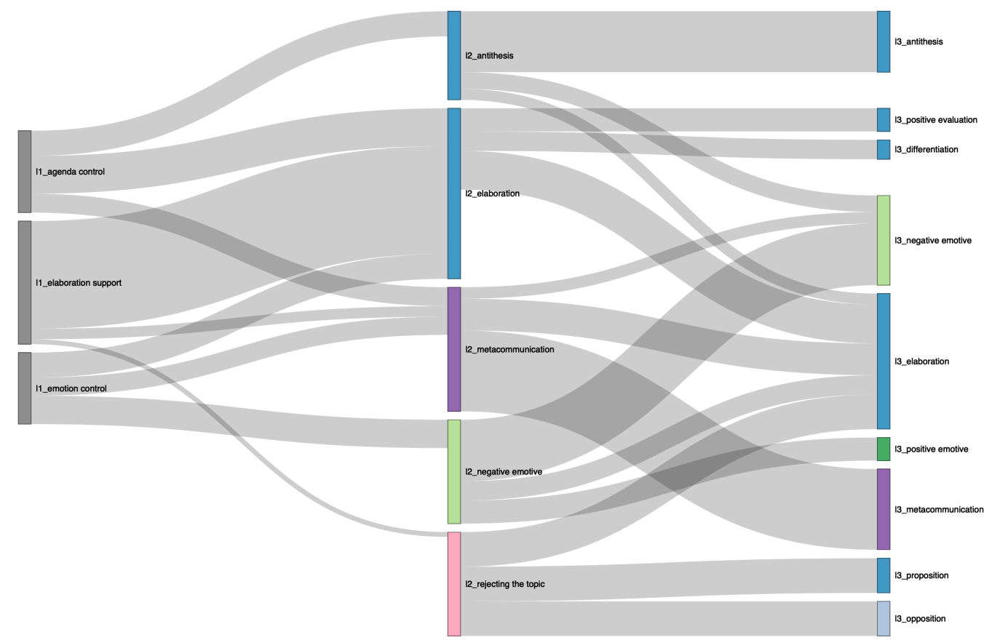
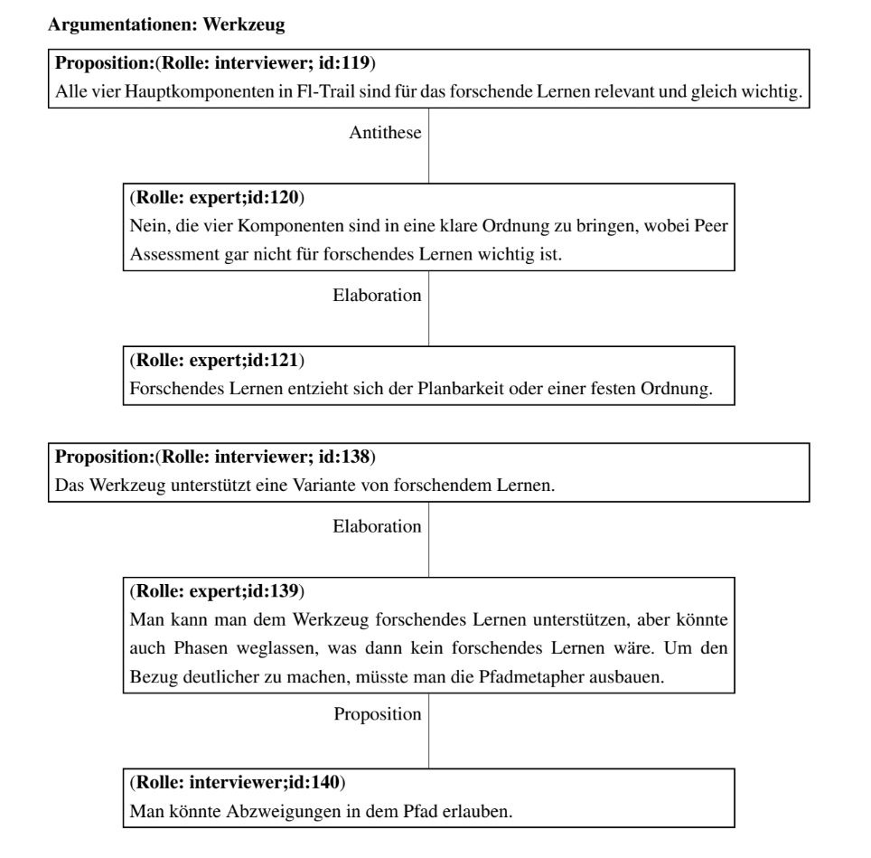

---
title: "Forschungsparadigmen und Methoden für RSEs"
subtitle: "Sitzung 2: Grundlagen qualitativer Forschung für RSE"
format:
    beamer:
        keep-tex: true
        aspectratio: 169
        navigation: horizontal
        pdf-engine: pdflatex
        include-in-header:
            - beamer-header.tex
        latex-auto-install: true
        section-titles: true
        mermaid: true

bibliography:
    - references.bib
    - rse_literature.bib
---

# Definitionsversuch

"Qualitative Forschung hat ihren Ausgangspunkt im Versuch eines vorrangig deutenden und sinnverstehenden Zugangs zu der interaktiv "hergestellt" und in sprachlichen wie nicht-sprachlichen Symbolen repräsentiert gedachten sozialen Wirklichkeit [@bergerSocialConstructionReality2011]

# Grundannahmen

- nicht alles ist messbar
- durch die Interpretation von Symbolen, in denen Wirklichkeit dokumentiert wird, kann man sie rekonstruieren
- es gibt eine Interaktion zwischen forschenden und beforschten
- die Forscher*innen sind Teil der sozialen Wirklichkeit und können sich dem nicht entziehen

# Nicht alles ist messbar

Zum Beispiel:

- Deutungen, Interpretationen, Anatomie einer (Forschungskultur)
- Korporierte soziale Beziehungen
- Habitualisierte Einflüsse
- Einflüsse von Milieus und Lebenswelten
- Unbewusste Alltagserfahrungen
- Einflüsse von akademischen Kulturen, Traditionen
- Figuren, Deutungsmuster, Deutungsroutinen, Rituale

# Kategorisierende Verfahren

- Diskursanalyse: sucht Wirkung von öffentlich diskutierten kollektiven Bedeutungen
- Hermeneutische Wissenssoziologie: Untersucht Deutungsroutinen, Sinnfiguren
- Dokumentarische Methode: Sucht handlungsleitendes Orientierungswissen, kollektives implizites Wissen
- Grounded Theory: Sucht die Bedeutung von Erfahrungen und Konstruktion von Bedeutung

&rarr; Ziel ist die Theoriebildung durch Entwicklung geeigneter Kategorien (Modellierung)

# Konkretes Vorgehen

1. Aufbereitung von Textmaterial
2. Paraphrasieren, Exzerpte relevanter Textpassagen (heutzutage eher mit MaxQDA relevante Textpassagen markieren und/oder Notiz anfügen)
3. Methodenabhängige Schritte
   -  Makrooperatoren ableiten (Auslassung, Generalisierung, Integration) bei qualitativer Inhaltsanalyse
   -  Diskursarten zuordnen (Diskursanalyse)
   -  Kreuztabelle sinngenetischer und soziogenetischer Kategorien entwerfen (Dokumentarische Methode)
   - Interpretationsschleifen, komplexe Erörterung, mehrfaches Lesen mit unterschiedlichen Interpretationen (Hermeneutik)

&rarr; Zusammenfassungen werden immer abstrakter, Kategorien werden "entdeckt"

# Beispiel: Diskursanalyse [@kleemannInterpretativeSozialforschung2013]

## Positive Gegenhorizonte

- **Ausarbeitung:** Erweiterung eines Punktes durch Details und Beispiele
- **Differenzierung:** Herausarbeitung von Unterschieden zwischen Konzepten
- **Validierung:** Belege zur Bestätigung eines Arguments
- **Ratifizierung:** Offizielle Bestätigung einer Entscheidung

---

## Negative Gegenhorizonte

- **Antithese:** Darstellung eines gegensätzlichen Konzepts
- **Widerspruch:** Ablehnung eines Standpunkts
- **Divergenz:** Aufzeigen alternativer Wege

## Thematische Schlussfolgerung

- **Positive Bewertung:** Positives Gesamturteil
- **Meinungssynthese:** Zusammenführung verschiedener Perspektiven

---

## Ritueller Abschluss

- **Themenwechsel:** Wechsel zu einem neuen Thema
- **Formale Synthese:** Strukturierte Zusammenfassung
- **Ablehnung des Themas:** Zurückweisung der Diskussion

## Emotionale Reaktion

- **Positiv/Humor:** Witze, lockere Kommentare
- **Negativ/Sarkasmus:** Ironie, spöttische Bemerkungen

# Beispiel 2:

{height=80%}

# Beispiel 3:

{height=80%}

# Das qualitative Experiment

Das qualitative Experiment ist der nach wissenschaftlichen Regeln vorgenommene Eingriff in eine soziale Gegebenheit zur Erforschung ihrer Struktur. Es ist die explorative, heuristische Form des Experiments.

---

## Merkmale

- Beurteilt speziell die Subjekt-Objekt-Verhältnisse
- Untersucht interpretativ nichtnumerische Daten in offenen Situationen
- Erkunden komplexer Zusammenhänge
- Sucht Strukturbildung (gruppendynamische Prozesse)
- Komplexe Verhaltenssituation wird manipuliert
- Nur als Gruppenexperimente durchführbar
- Ergebnisse nur bedingt verallgemeinerbar

→ Strukturveränderungen als Resultat manipulierter komplexer Verhaltensbedingungen werden gemessen (Stabilität der Struktur)

→ Welche Handlungs- / Bewertungsmuster bilden sich in typischen Situationen heraus?

---

## Techniken der Verhaltensmanipulation

- Separation / Segmentierung: Teile von Gruppen werden isoliert
- Kombination: Gruppen werden zusammengeführt
- Reduktion / Abschwächung: Funktionsinhaber werden entfernt
- Adjektion / Intensivierung: Funktionsinhaber werden hinzugefügt
- Substitution: Teile werden ausgetauscht
- Transformation: gesamte Gruppe wird neu strukturiert

# Literatur