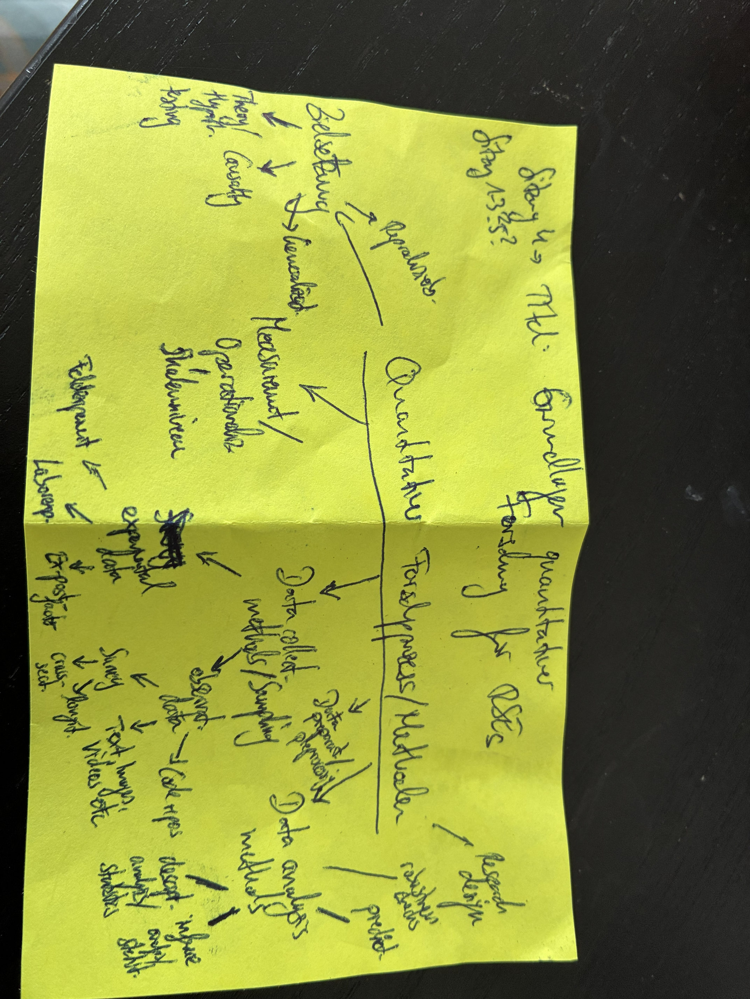
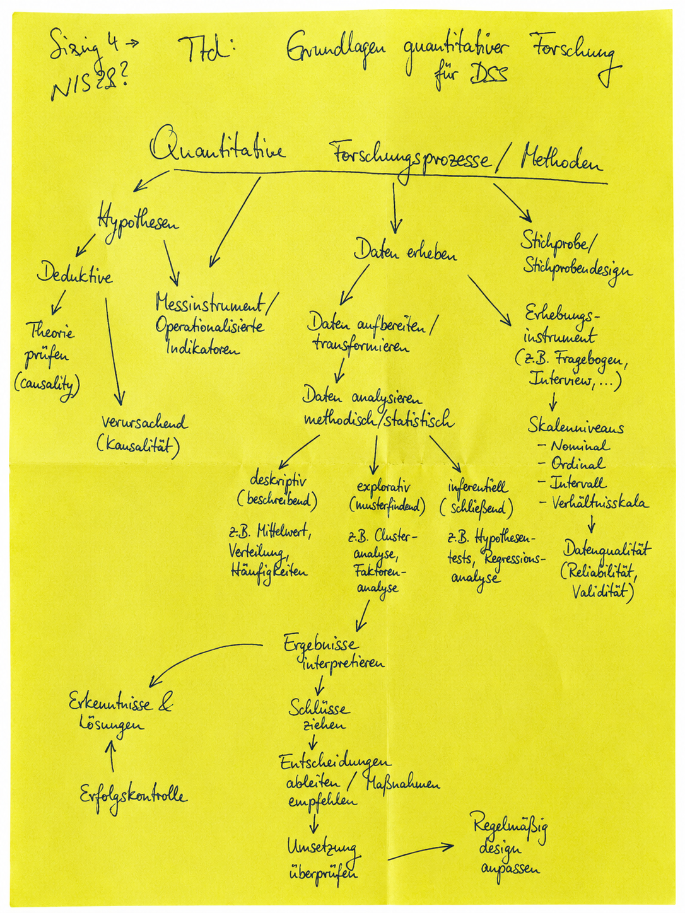
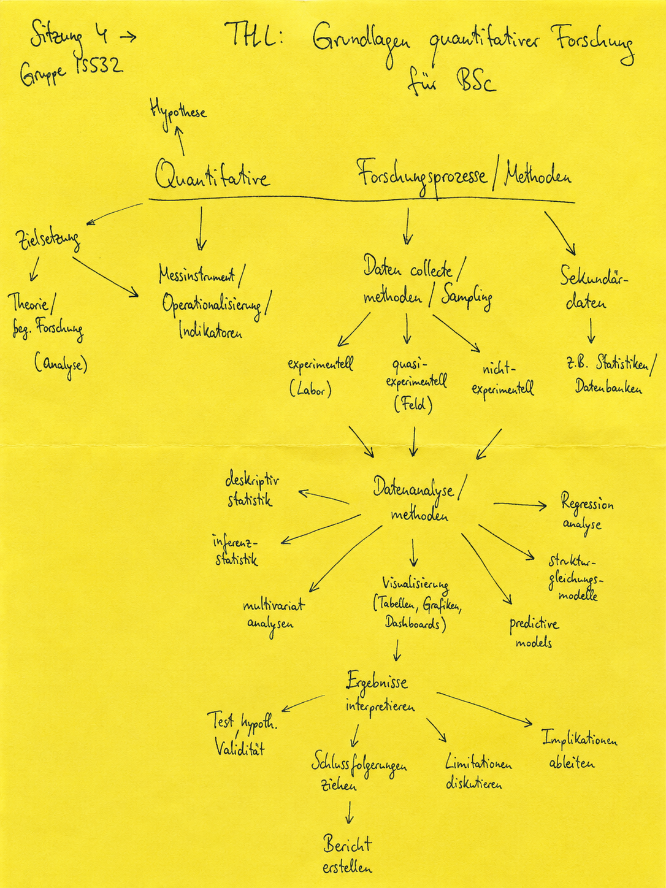
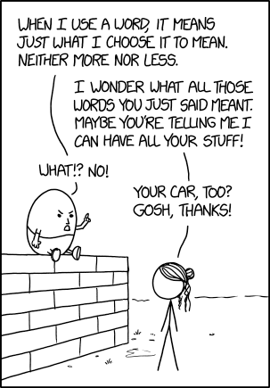
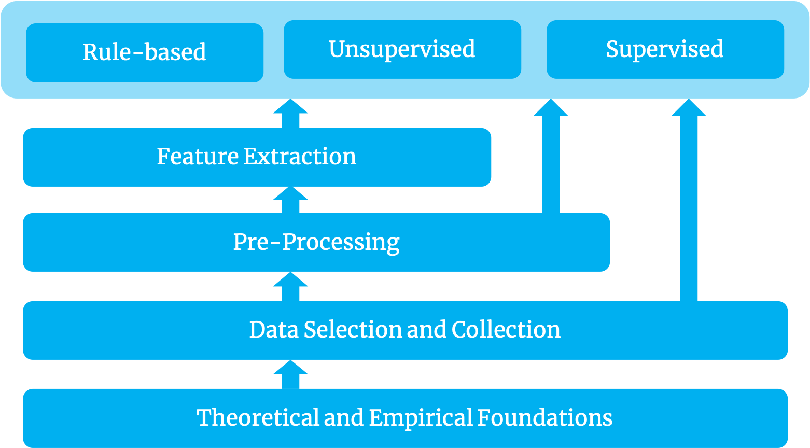
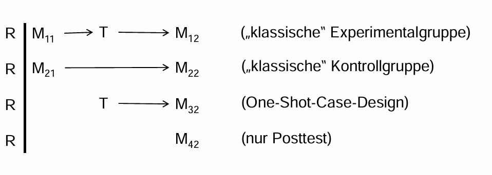

---
title: "Forschungsparadigmen und Methoden für RSEs"
subtitle: "Sitzung 4: Grundlagen quantitativer Forschung für RSE"
format:
    beamer:
        keep-tex: true
        #theme: Goettingen
        colortheme: crane
        fonttheme: structureitalicserif
        aspectratio: 169
        navigation: horizontal
        pdf-engine: pdflatex
        include-in-header:
            - beamer-header.tex
        latex-auto-install: true
        section-titles: true
        mermaid: true

bibliography:
    - references.bib
    - rse_literature.bib
---


# Quantitative Methoden

{height="70%"}


# Quantitative Methoden

{height="70%"}


# Quantitative Methoden

{height="70%"}

---

## Das quantitative Experiment [@zapf]

„Wiederholbare Beobachtungen unter kontrollierten Bedingungen, wobei eine (oder mehrere) unabhängige Variable(n) derartig manipuliert werden, dass eine Überprüfungsmöglichkeit der zugrunde liegenden Hypothese (Behauptung eines Kausalzusammenhangs) in unterschiedlichen Situationen gegeben ist.“

- Experiment funktioniert nur, wenn der Reiz zu Realverhalten führt
- Exakteste Messmethode, aber nicht immer durchführbar
- Untersuchung der Wirkung wesentlicher Variablen
- Misst objektive, subjektive, materielle und ideelle Determinanten
- Analysiert numerische Daten über Beziehungen von Verhaltensvariablen
- In kontrollierten Situationen
- Vereinfacht komplexe Zusammenhänge
- Testet Hypothesen
- Unabhängige Variable wird manipuliert

&rarr;  Verhaltensdifferenzen als Resultat der Manipulation werden gemessen

---

## Vor- und Nachteile [@zapf]

**Vorteil:**

- Exakteste Messung (bei isolierten, kontrollierten, manipulierten Variablen)

**Nachteil:**

- Kenntnis wesentlicher Variablen nötig
- Einfluss von Störvariablen muss vermieden werden
- Hoher Schulungsaufwand

---

# Arten von Experimenten [@zapf]

## Feldexperiment:

- Authentische Situation
- Untersuchungsobjekt bleibt in natürlicher Umgebung
- Zwei kontrastierende Gruppen
- Nicht alle Variablen kontrollierbar

---

## Laborexperiment:

- Künstliche, kontrollierte Situation
- „Reine“, vereinfachte Bedingungen
- Experimentalgruppe + Kontrollgruppe
- Alle Variablen kontrollierbar
- Fokus: Wirkung der unabhängigen Variable

---

## Ex-post-facto Experiment (Quasiexperiment):

- Untersuchung vergangener sozialer Vorgänge
- Rückverfolgung zu kausalen Faktoren
- Nutzung von Dokumenten
- Beispiel: Einfluss des Abiturs auf sozialen Erfolg

---

# Unterformen [@zapf]

## Kontrollgruppenexperiment:

- Mindestens zwei ähnliche Gruppen (Zufallsverteilung)
- Eine Gruppe wird manipuliert, eine nicht
- Vergleich von Vorher-/Nachher-Messungen
- Verhaltensdifferenz wird gemessen
- Nachteil: Gruppen nie exakt identisch

## Zeitreihenexperiment:

- Gleiche Gruppe mehrfach gemessen
- Sequenz: ohne – mit – ohne Einwirkung
- Verhaltensdifferenz wird gemessen
- Nachteil: Gruppenveränderung (z. B. Ausstieg)

---

## Voraussetzungen [@zapf]

1. Variablen und Bedingungen müssen kontrollierbar sein
2. Hypothesen müssen Zusammenhänge zwischen Variablen formulieren
3. Verhaltensvariablen müssen isolierbar sein
4. Unabhängige Variable muss manipulierbar sein
5. Manipulation muss wiederholbar sein

## Anwendungsgebiete [@zapf]

1. Maximierung und Minimierung
2. Testen von Grenzen
3. Adaption (Anpassung)

---

## Einwände [@zapf]

1. Self-fulfilling-prophecy
   (Verhalten im Experiment anders als in Realität)

2. Self-destroying process
   (Aufgabe wird so stark internalisiert, dass Verhalten verzerrt wird)

3. Ethische (moralische) Einwände
   (Grenzen individuell festzulegen, kein dauerhafter Schaden)

4. Selektivität des Experiments
   (Erklärt nicht das „wahre Leben“)

---

## Arbeitsschritte [@zapf]

- Festlegung der bedeutsamen Faktoren
- Hypothesen aufstellen
- Manipulierte Variable festlegen
- Bestimmung von Experimental- und Vergleichsgruppe
  (nach soziodemographischen Faktoren oder Zufallsauswahl)
- Konstruktion der Experimentalsituation
  (wer, wann, wo, wie, womit)
- Prätest


# Die quantitative Inhaltsanalyse / Dokumentenanalyse [@zapf]

Inhaltsanalyse meint das Interpretieren von Symbolen mit wissenschaftlichen Methoden.

## Symbol [@zapf]

- Marker für Begriffe
- Menschliches Denken ist an Symbolgebrauch gebunden
- Symbole haben Bedeutung für Menschen
- Erschließt sich die Bedeutung → löst Handlungen aus
- Voraussetzung für Interaktionen

---

## Merkmale [@zapf]

- Hat Kommunikation zum Gegenstand
- Arbeitet mit symbolischem Material (fixierte Kommunikation)
- Geht systematisch vor
- Ist regelgeleitet
- Ist theoriegeleitet
- Ist eine schlussfolgernde Methode (Rückschlüsse auf Kommunikation)
- Rekonstruiert die Verteilung von Merkmalen in Populationen
- Sucht Typen von Kommunikationsmustern und -ergebnissen
- Hilfsmittel zur Überprüfung qualitativ gewonnener Hypothesen

---

## Methoden [@zapf]

- Vom Analysenmaterial wird auf den Kontext geschlossen
- Hoher Systematisierungsgrad wird angestrebt
- Reduktion von Informationen
- Zuordnung von Textteilen zu Merkmalen
- Übersetzung der Objektsprache in Metasprache (sozialwissenschaftliche Kategorien)
- Diktionär = inhaltsanalytisches Wörterbuch

---

## Anwendungsgebiete [@zapf]

- Informationsbeschreibung und Normenprüfung
- Informationsraffung und Informationsbeschleunigung
- Informationsgenese (Entwicklung von Inhalten in Abhängigkeit zur sozialen Wirklichkeit)
- Prognosen


# Text als Daten (Gold 2022)

::: {.columns}

::: {.column width="40%"}

{height="70%"}

https://xkcd.com/1860/, CC2.5

:::

::: {.column width="40%"}

Annahmen:

- Texte sind eine wertvolle Ressource für die Analyse
- Die interessierenden Einheiten können aus Texten extrahiert werden, z. B. durch das Messen von Merkmalen
- Bag-of-Words-Annahme
- Berücksichtigung von Kontext
- Zuverlässige Schätzungen der manifesten und/oder latenten interessierenden Konstrukte (= Inferenz)

:::

:::

# Relevanz von Text als Daten (Gold 2022)

- Texte vermitteln von Natur aus Informationen und sind daher wertvolle Quellen für systematische Analysen [@Benoit2020, S. 463].
- Die fortschreitende Digitalisierung der Welt hat zu einer stetig wachsenden Verfügbarkeit großer Textmengen geführt [@BubenhoferScharloth2015, S. 2].
- Die Entwicklung und Anwendung neuer computergestützter Methoden zur Textverarbeitung, einschließlich des interdisziplinären Transfers („Migration“) von Algorithmen sowie jüngster Fortschritte bei großen Sprachmodellen wie ChatGPT.
- Die „Emanzipation der Daten“ [@BubenhoferScharloth2015, S. 2]: Viele Textdaten werden ursprünglich nicht zu Analysezwecken erzeugt, sondern für die Forschung zweckentfremdet.


# Prinzipien von Text als Daten [@GrimmerRobertsStewart2022]

1. Sozialwissenschaftliche Theorien und fachliches Wissen sind essenziell für das Forschungsdesign
2. Textanalyse ersetzt den Menschen nicht — sie ergänzt ihn
3. Der Aufbau, die Verfeinerung und das Testen sozialwissenschaftlicher Theorien erfordern Iteration und Kumulation
4. Textanalysemethoden destillieren Verallgemeinerungen aus Sprache
5. Die beste Methode hängt von der jeweiligen Aufgabe ab
6. Validierung ist essenziell und hängt von Theorie und Aufgabe ab

# Vorgehen (Gold 2022)

{height="70%"}

# Skalen [@bortz2006forschungsmethoden]

- nominalskalierte Variablen: Bezeichnungen sind eindeutig, erlaubt Aussagen über verschiedenheit der Merkmalsträger
- ordinalskalierte Variablen: Aussage über Reihenfolge
- intervallskallierte Variablen: Differenzen zwischen Werten sind eindeutig
- verhältnisskalierte Variablen: Wie Intervallskalen aber mit eindeutigem Nullpunkt
- absolutskalierte Variablen: z.B. Häufigkeit


# Verständnisfrage

Welche der folgenden Transformationen sind (a) bei einer Nominalskala und (b) bei einer Verhältnisskala zulässig?

1. eineindeutige Transformation
2. streng monotone Transformation
3. positiv lineare Transformation
4. Ähnlichkeitstransformation
5. Identitätstransformation


# Mathematische Eigenschaften [@bortz2006forschungsmethoden]

| Skala      | Alle ein- eindeutigen Trans- formationen | Alle  <br> streng monotonen Trans- formationen | Alle <br> positiv linearen  Trans- formationen | Alle Ähnlichkeits- trans- formationen | Alle Identitäts- trans- formationen. |
|------------|-----------------------------------------:|-----------------------------------------------:|-----------------------------------------------:|--------------------------------------:|-------------------------------------:|
| Nominal    |                                       ja |                                             ja |                                             ja |                                    ja |                                   ja |
| Ordinal    |                                     nein |                                             ja |                                             ja |                                    ja |                                   ja |
| Intervall  |                                     nein |                                           nein |                                             ja |                                    ja |                                   ja |
| Verhältnis |                                     nein |                                           nein |                                           nein |                                    ja |                                   ja |
| Absolut    |                                     nein |                                           nein |                                           nein |                                  nein |                                   ja |


# Untersuchungspläne [@maaz]: One-Shot Case Study

**Beispiel: Bewerbungstraining für Arbeitslose**

```{mermaid}


flowchart LR
  T[T] --> M[M]
```

T: Treatment (Bewerbungstraining)

M: Messung (z.B. Qualität der Bewerbungen,
Einladungen zum Vorstellungsgespräch)

**Störvariablen:**
- Unterschiede in M können auch schon vor dem Treatment bestehen


# „Ein-Gruppen-Pretest-Posttest-Design“ [@maaz]

```{mermaid}

flowchart LR
  M1[M1] --> T[T]
  T --> M2[M2]
```

T: Treatment (Bewerbungstraining)

M1: Pretestmessung

M2: Posttestmessung

**Störvariablen:**

- zwischenzeitliche Einflüsse unabhängig vom Treatment
- Untersuchungsteilnehmer entwickeln sich unabhängig vom Treatment weiter
- allein die Pretestmessung verändert das Verhalten
- gemessenes Verhalten ohnehin starker Variabilität unterliegt


# Ex-post-facto-Plan (ohne Randomisierung) [@maaz]

```{mermaid}
flowchart TB

  subgraph EG[Experimentalgruppe]
    direction LR
    T[T] --> M1[M1]
  end

  subgraph VG[Vergleichsgruppe]
    direction LR
    M2[M2]
  end

  style EG fill:transparent,stroke:transparent
  style VG fill:transparent,stroke:transparent
```

T: Treatment (Bewerbungstraining)

M1: Posttestmessung

M2: Messung Vergleichsgruppe

**Störvariablen:** Unterschiede zwischen Gruppen können schon vorher bestehen


# Kontrollgruppenplan mit Pre- und Posttest (ohne Randomisierung) [@maaz]

::: {.columns}

::: {.column width="40%"}
```{mermaid}
%%| fig-width: 2.5
flowchart LR

  M11[M11] --> T[T]
  T --> M12[M12]

  M21[M21] --> M22[M22]
```

T: Treatment (Bewerbungstraining)

M11 und M12: Pre- und Posttestmessung Experimentalgruppe

M21 und M22: Pre- und Posttestmessung Kontrollgruppe

:::

::: {.column width="40%"}

**Störvariablen:**

- Experimental- und Kontrollgruppe können sich in nicht-beobachteten Variablen unterscheiden (z.B. Motivation eine Stelle zu finden)
- unerwünschte Effekte der Pretestmessung

:::

:::

# Solomon-Vier-Gruppen-Plan [@maaz]




---

- „klassische“ Experimentalgruppe: M11 &rarr; T &rarr; M12
- „klassische“ Kontrollgruppe: M21 &rarr; M22
- One-Shot-Case-Design: T &rarr; M32
- nur Posttest: M42

Der Solomon-Viergruppenplan dient dazu, die mögliche Wirkung von Pretesteffekten zu überprüfen.


# Kombination der Untersuchungsvarianten [@maaz]

|           | Experimentell                                    | Quasiexperimentell                                 |
|:----------|:-------------------------------------------------|:---------------------------------------------------|
| **Feld**  | Interne Validität + \newline Externe Validität + | Interne Validität - \newline  Externe Validität +  |
| **Labor** | Interne Validität + \newline Externe Validität -         | Interne Validität - \newline Externe Validität -           |


# Gruppenarbeit - Breakoutrooms

Welches Studiendesign wählen Sie zur empirische Evaluation folgender Forschungssoftware?

1. Sie haben eine Weboberfläche entwickelt, die Ressourcen für die Wissenschaftskommunikation bündelt (Zielgruppe: Wissenschaftler:innen)
2. Sie haben eine VR-Plattform entwickelt, mit der Azubis Autos lackieren üben können.
3. Sie haben eine App entwickelt, damit mehr FLINTA Personen Informatik studieren (https://techstudyfinder.gi.de/)
4. Sie haben einen Chatbot entwickelt, der auf Social Media versucht zu deeskalieren und produktive Gespräche zu fördern.


# Literatur {.allowframebreaks}

::: {#refs}
:::

