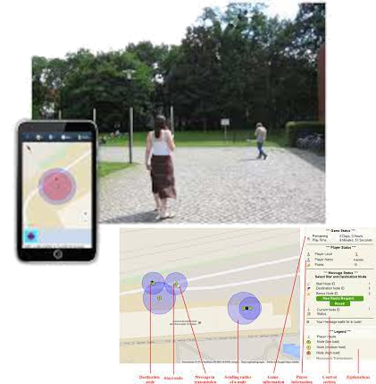
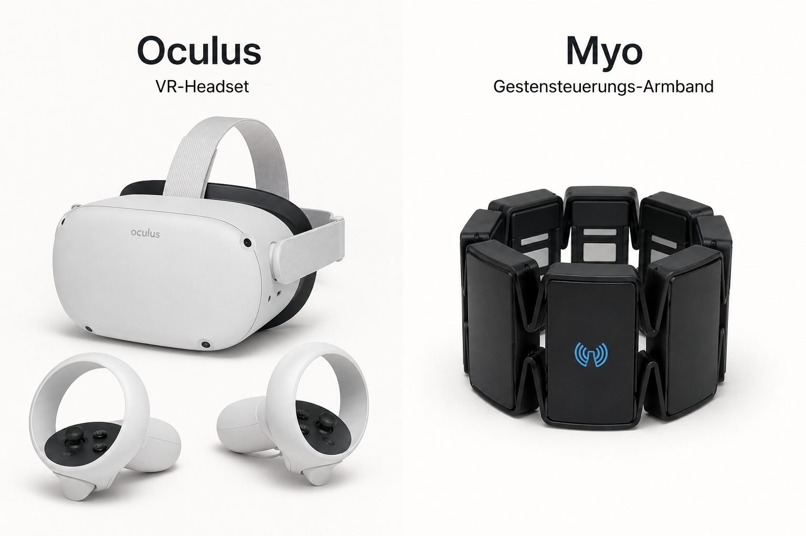
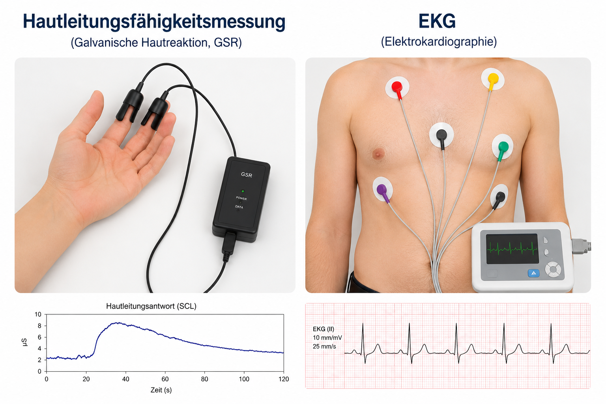
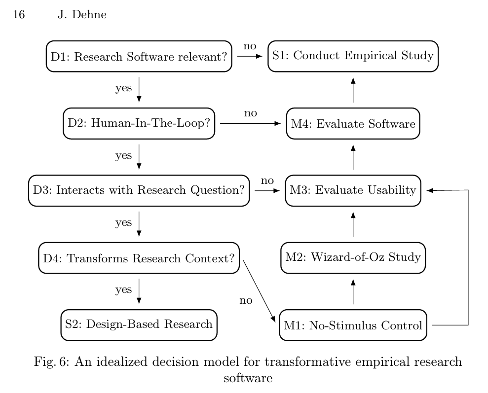

# Traditionelle Formen der Softwareevaluation [@karatSoftwareEvaluationMethodologies1988]

## Evaluationstechniken I

+--------------------------+----------------------------------------+--------------------------------------------------+
| Methode                  | Art der Information                    | Geeigneter Einsatz                               |
+==========================+========================================+==================================================+
| Fragebogen               | Subjektive Antworten auf gestellte     | In jeder Phase geeignet, wenn konkrete Fragen    |
|                          | Fragen. Besonders geeignet für         | formuliert werden können                         |
|                          | spezifische Fragestellungen.           |                                                  |
+--------------------------+----------------------------------------+--------------------------------------------------+
| Verbaler Bericht         | Aufzeichnung kognitiver Prozesse       | Früh im Entwicklungsprozess, wenn allgemeine     |
|                          | bei der Systemnutzung.                 | Informationen benötigt werden                    |
+--------------------------+----------------------------------------+--------------------------------------------------+
| Kontrollierte Experimente| Spezifische Messwerte in einer         | Für gezielte Tests wichtiger Alternativen        |
|                          | kontrollierten Umgebung.               | oder Hypothesen                                  |
+--------------------------+----------------------------------------+--------------------------------------------------+

---

## Evaluationsmethoden II

+-----------------------------+----------------------------------------+--------------------------------------------------+
| Methode                     | Art der Information                    | Geeigneter Einsatz                               |
+=============================+========================================+==================================================+
| Design Review               | Plausibilitätsprüfung des Designs      | Früh im Designprozess, um frühe                  |
|                             | hinsichtlich allgemeiner Akzeptanz.    | Entscheidungen zu überprüfen                     |
+-----------------------------+----------------------------------------+--------------------------------------------------+
| Formale Analyse (GOMS)      | Vorhersagen über das Verhalten         | Als Ersatz für Nutzertests zur Vorhersage        |
|                             | erfahrener Nutzer                      | der Gebrauchstauglichkeit                        |
+-----------------------------+----------------------------------------+--------------------------------------------------+
| Produktions- systemanalyse  | Vorhersagen über Lernen, Nutzung       |   Zur Ergänzung anderer Analysedaten             |
|                             | und Transferverhalten                  |                                                  |
+-----------------------------+----------------------------------------+--------------------------------------------------+

---

::: {.columns}

::: {.column width="40%"}

{width=90%}

:::

::: {.column width="40%"}

## Evaluationsmethoden III: Moderne Varianten

- Agentenbasierte GUI-Tests [@chen2026humanliketesting]
- Verhaltensspuren
    - Logdaten
    - Zeitstempel
    - Mobile Sensoren: Geolokation, Richtungsänderung ...

:::

:::

---

::: {.columns}

::: {.column width="40%"}

:::

::: {.column width="40%"}

## Evaluationsmethoden IV: Kommerzielle Schnittstellen

- Reihe von kommerziellen Sensorsystemen: Oculus, Kinect und Myo armband
- Messbare Daten [@rechy-ramirezImpactCommercialSensors2018]:
    - emotionale Veränderungen
    - Gesichtsausdrücke
    - Gedanken
    - Kopfbewegungen
    - Skeletale Bewegungen
    - ...

:::

:::

# Empirische Verteilung im DeLFI-Korpus

Für jeden der 1052 Beiträge wurde aus den LLM-Begründungen per Dependency-Parsing das grammatikalische Objekt der Softwareevaluation (SE) und der empirischen Studie (EMP) extrahiert und als *software-intern* oder *extern* klassifiziert.

---

## Ausrichtung von Softwareevaluation und empirischer Studie

+------------------------------------------+-------+--------+
| Muster                                   | n     | %      |
+==========================================+=======+========+
| Nur externe Empirie (SE=0, EMP=1)        | 289   | 27,5 % |
+------------------------------------------+-------+--------+
| Unklar                                   | 218   | 20,7 % |
+------------------------------------------+-------+--------+
| Zwei getrennte Studien                   | 199   | 18,9 % |
+------------------------------------------+-------+--------+
| Eine Studie, Software-Fokus              | 158   | 15,0 % |
+------------------------------------------+-------+--------+
| Keine Studie (SE=0, EMP=0)               | 115   | 10,9 % |
+------------------------------------------+-------+--------+
| Eine Studie, externer Fokus              | 48    | 4,6 %  |
+------------------------------------------+-------+--------+
| Invertiert (vermutl. Misklass.)          | 19    | 1,8 %  |
+------------------------------------------+-------+--------+
| Nur Softwareevaluation (EMP=0)           | 6     | 0,6 %  |
+------------------------------------------+-------+--------+

---

## Verteilung der Forschungssoftware-Typen

Häufigste Typen in den 878 Beiträgen mit Forschungssoftware (Mehrfachzuordnung pro Beitrag möglich):

+--------------------------------+-------+-------------+
| Typ                            | n     | % von 878   |
+================================+=======+=============+
| Tool                           | 251   | 28,6 %      |
+--------------------------------+-------+-------------+
| System                         | 188   | 21,4 %      |
+--------------------------------+-------+-------------+
| Algorithmus                    | 124   | 14,1 %      |
+--------------------------------+-------+-------------+
| Plattform                      | 101   | 11,5 %      |
+--------------------------------+-------+-------------+
| Berechnungsworkflow            | 62    | 7,1 %       |
+--------------------------------+-------+-------------+
| Virtual Reality                | 52    | 5,9 %       |
+--------------------------------+-------+-------------+
| Quellcode                      | 52    | 5,9 %       |
+--------------------------------+-------+-------------+
| Framework                      | 48    | 5,5 %       |
+--------------------------------+-------+-------------+
| Learning Management System     | 40    | 4,6 %       |
+--------------------------------+-------+-------------+
| Web-Applikation                | 39    | 4,4 %       |
+--------------------------------+-------+-------------+
| Modul                          | 37    | 4,2 %       |
+--------------------------------+-------+-------------+
| Spiel                          | 34    | 3,9 %       |
+--------------------------------+-------+-------------+

\footnotesize
Extrahiert per Regex-Vokabular aus den LLM-Annotationen (GPT-4o-mini); pro Beitrag sind Mehrfachzuordnungen möglich.

---

## Tentative Verteilung in der DeLFI-Community

Anwendung der obigen Taxonomie auf 1052 DeLFI-Beiträge (2003--2025), klassifiziert per Regex-Mustererkennung auf LLM-Annotationen (GPT-4o-mini):

+------------------------------+-------+-------------+
| Methode                      | n     | % von 205   |
+==============================+=======+=============+
| Fragebogen                   | 154   | 75,1 %      |
+------------------------------+-------+-------------+
| Kontrolliertes Experiment    | 23    | 11,2 %      |
+------------------------------+-------+-------------+
| Verhaltensspuren             | 15    | 7,3 %       |
+------------------------------+-------+-------------+
| Design Review                | 11    | 5,4 %       |
+------------------------------+-------+-------------+
| Kommerzielle Sensorsysteme   | 6     | 2,9 %       |
+------------------------------+-------+-------------+
| Verbaler Bericht             | 5     | 2,4 %       |
+------------------------------+-------+-------------+
| Formale Analyse (GOMS)       | 1     | 0,5 %       |
+------------------------------+-------+-------------+
| Agentenbasierte GUI-Tests    | 0     | 0 %         |
+------------------------------+-------+-------------+
| Produktionssystemanalyse     | 0     | 0 %         |
+------------------------------+-------+-------------+

---

## Vorläufige Daten

 847 von 1052 Beiträgen (80,5 %) ließen sich keiner Kategorie zuordnen --- meist wegen abstrakter Methodenbeschreibungen in den LLM-Annotationen. Bezugsgröße der Prozentwerte: $n = 205$ klassifizierte Beiträge (9 davon in mehr als einer Kategorie). Quelle: ICSE-2027-Sekundärstudie zum DeLFI-Korpus.

---

## Forschungssoftware-Typ × Evaluationsmethode

Absolute Häufigkeiten (Top-8 Typen × Karat-Methoden mit $\geq 1$ Fall):

+----------------------------+------------+------------+--------+--------+----------+---------+
| Typ                        | Survey     | Kontr.Exp. | Spuren | Review | Sensoren | Bericht |
+============================+============+============+========+========+==========+=========+
| Tool                       | 37         | 9          | 3      | 2      | 0        | 2       |
+----------------------------+------------+------------+--------+--------+----------+---------+
| System                     | 26         | 1          | 2      | 1      | 2        | 0       |
+----------------------------+------------+------------+--------+--------+----------+---------+
| Algorithmus                | 10         | 1          | 1      | 3      | 0        | 1       |
+----------------------------+------------+------------+--------+--------+----------+---------+
| Plattform                  | 20         | 3          | 2      | 1      | 1        | 0       |
+----------------------------+------------+------------+--------+--------+----------+---------+
| Berechnungsworkflow        | 9          | 3          | 0      | 2      | 0        | 0       |
+----------------------------+------------+------------+--------+--------+----------+---------+
| Virtual Reality            | 8          | 5          | 0      | 0      | 1        | 0       |
+----------------------------+------------+------------+--------+--------+----------+---------+
| Framework                  | 6          | 1          | 2      | 1      | 0        | 0       |
+----------------------------+------------+------------+--------+--------+----------+---------+
| LMS                        | 8          | 0          | 3      | 0      | 0        | 0       |
+----------------------------+------------+------------+--------+--------+----------+---------+

# The RIGHT framework

# Literatur {.allowframebreaks}

::: {#refs}
:::
